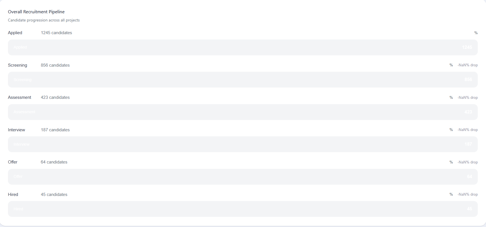
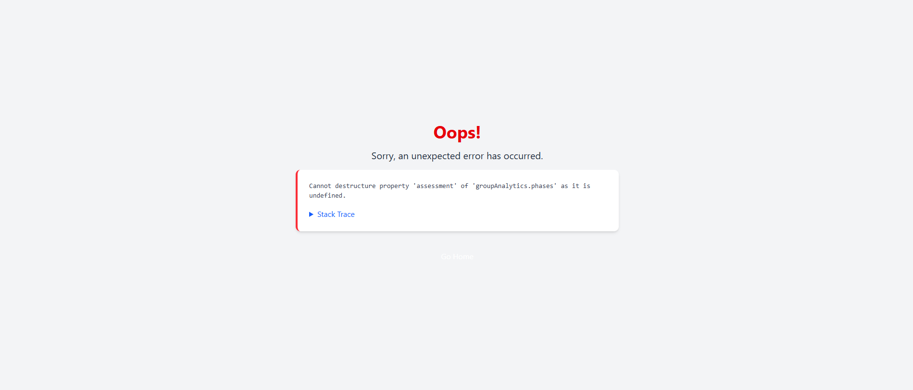

Remaining hardcoded values & UI Issues  : 
****************************
Admin : 
*********

* Admin login page 
export function AdminLoginPage({ onBack, onSignIn }: AdminLoginPageProps) {
  const [email, setEmail] = useState('');
  const [password, setPassword] = useState('');

  const handleSubmit = (e: React.FormEvent) => {
    e.preventDefault();
    // Demo credentials check
    if (email === 'admin@eramatch.com' && password === 'admin123') {
      onSignIn();
    } else {
      alert('Invalid credentials. Please use:\nEmail: admin@eramatch.com\nPassword: admin123');
    }
  };

* Admin Dashboard 

1. We have to fix out the UI part in the progress bar blue color it's now shown properly

2. Insights of every group are not shown properly

3. I have configured that there exist alot of weights and percentages are populated manually not Using API !

* AdminOrganizationMembers.tsx

1. We have fully hardocoded values in the three cards at the begining of the page 
2. Review also the Register Employee if it's succeffully adding empolyees to the table !!! 

* AdminRecruiterDelegation.tsx

1. Delegation Page have empty table !!!!!

* AdminClosedPositions.tsx

1. Closed Positions Archive page have empty table !!!!